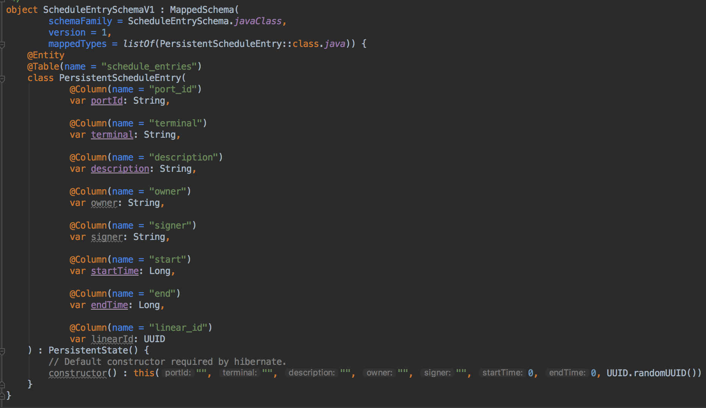
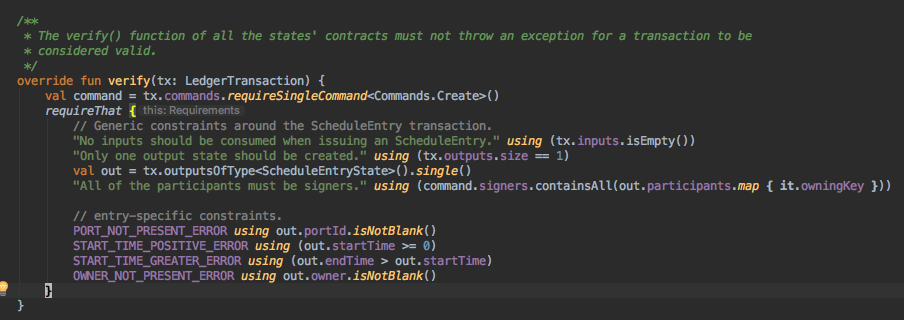
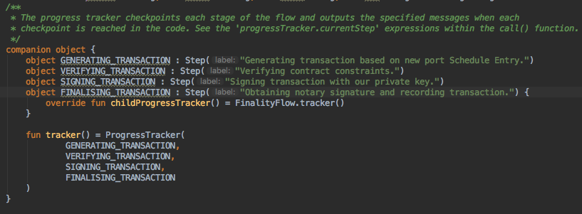
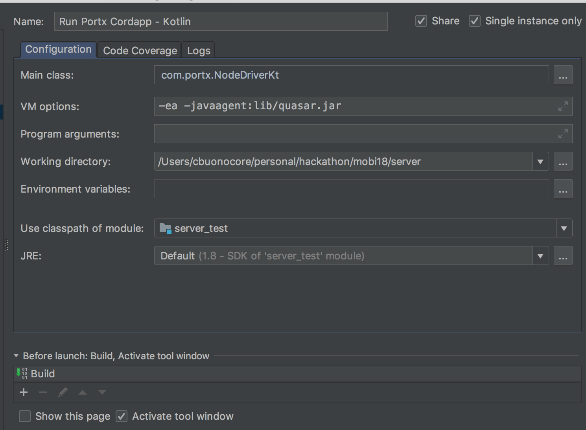

  

# PortX

<!-- A port reservation system powered by blockchain -->

An Blockchain-based platform for managing reservations at ports, transparently and efficiently.

## Inspiration

Severe problems are created at ports when drivers can’t move through terminals effectively. The increase in turn times is, in part, due to a high volume of containers passing through the ports, but is exacerbated by inefficiencies at the ports themselves as the ports struggle to find ways to keep up with increasing container volumes. In an effort to increase efficiency and decrease congestion to reduce turn times, ports across the country are working to implement new systems and procedures.

Ports and trucking companies operate independently, but often have to share resources. The goal of this project is to create a prototype of an online reservation system based on blockchain that will ultimately allow these vehicles to autonomously reserve and manage scheduling at different ports throughout the world.

## What it does

PortX provides an online platform for reserving time slots at different ports. Trucking companies can share their intent by placing a reservation (if available) at any of the listed ports. Other companies can see that there's an existing reservation, without having to disclose unecessary identifying information to other parties about who is actually in the specific time slot.

## How we built it
* `portx/` - client side code (website) for the portx project
* `server/` - server side code (ledger recording and querying logic) for portx. This server side code is backed by Corda (an open source blockchain project): https://github.com/corda/corda.

### The Core Objects

<h5>Schedule Entry Schema: </h5>

The unit of data or state on the PortX ledger.

The V1 of our schema is relatively basic/foundational. There are few key fields - we'll later add capacities, reservation revisions, and other behavior

* *port_id*: The identifier for the port (indicated in the manifest ports.json
* *owner*: The username of the user making the reservation
* *terminal*: The terminal or door at the port of the reservation.
* *description*: Varies, can typically discuss the content of the delivery/pickup being processed, or contain other information about the reservation.
* *signer*: The name of the node signing and validating the transaction for addition to the ledger
* *start*: The start time of the reservation in ms (epoch).
* *end*: The end time of the reservation in ms (epoch).
* *linear_id* : The UUID of the transaction.

<h5>Schedule Entry Contract:</h5>

The contract for initiating/validating a ledger transaction. We also then verify that an incoming transaction doesn't conflict with an existing one (i.e. schedule conflict). We require at least one node in the network to sign off on the contract.

<h5>Schedule Entry Flow:</h5>

The process of agreeing upon ledger updates containing new data.

## Challenges we ran into

Creating a distributed ledger backend was something that we weren't used to doing. We wanted to enable blockchain interaction while simultaneously providing core features such as port lookup and search. We leveraged the open source contract framework corda (https://github.com/corda/corda) to create a ledger-based booking system, which we adapted for instead for schedule tracking.

## Accomplishments that we're proud of

It works.

## What we learned

How to implement flow states for secure/notarized contracts using a Corda. Creating a UI interface for querying and displaying the information state of the blockchain in an intuitive and user friendly way. While the blockchain (and internal storage mechanism) of the actual reservations are abstracted away, users can still get all the benefit, without the complexity, by using the PortX web interface and API's.

## Building and running the project

<h4>From the `server` folder:</h4>

<h5>Running a single node (from an Intellij build configuration):</h5>

<h5>Running a cluster (example)</h5>
This project is based on Corda (https://github.com/corda/corda), to run the sample node configuration the following command can be used once the project is setup locally.
<pre>
    ./gradlew deployNodes
</pre>

Refer to <a href="https://docs.corda.net/tutorial-cordapp.html#running-nodes-across-machines">Running  Nodes</a> from the Corda docs for more information.

<h4>From the `client` folder:</h4>
<pre>
    yarn && yarn start
</pre>

The app should now be running on port 8000, with the server responding on port 8001.

## What's next for PortX

Next step would be to pilot the reservation system with a few ports or companies. This could be done with not a lot of overhead as long as we have access to some subset of their scheduling manifest information. The bookings can be managed autonomously through the PortX API if scripted. This would allow portx to seemlessly integrate a ledger based reservation system with their current workflows. PortX could also be generalized as a reservation system for other assets shared by vehicles, where those vehicles could be configured to automatically place reservations for the particular time slot which could then be visible to others via the ledger and API's.

PortX can benefit one port (by providing immutability, security, and booking automation) to any number of ports. 

## Other Resources
* https://github.com/corda/corda
* https://www.fandpnet.com/increased-congestion-at-the-ports-leads-to-problems-for-the-trucking-industry/
* https://blog.goodaudience.com/the-future-of-mobility-fuelled-by-artificial-intelligence-and-distributed-ledger-technology-999b36bc836f
* https://blog.iota.org/iota-foundation-and-high-mobility-to-drive-app-development-for-smart-mobility-bde0596940bc
